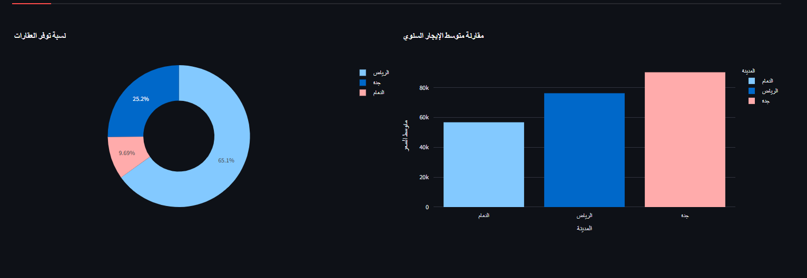

# 🏠 House Rent Price Prediction & Dashboard

This project predicts **house rental prices** using Machine Learning and provides an **interactive dashboard built with Streamlit**.

The goal of this project is to analyze housing data and build a model that can estimate rental prices based on property features such as size, bedrooms, bathrooms, and location.

---

# 📊 Project Overview

The project consists of the following stages:

### 1️⃣ Exploratory Data Analysis (EDA)

* Explored the dataset using **Pandas**
* Checked data types and missing values
* Identified and removed **outliers using IQR**
* Analyzed relationships between house features and price
* Visualized the data using **Matplotlib** and **Seaborn**

---

### 2️⃣ Machine Learning Models

Two machine learning models were trained:

* **Linear Regression** (baseline model)
* **Random Forest Regressor** (final model)

The models were evaluated using:

* MAE
* MSE
* RMSE
* **R² Score**

Random Forest achieved better performance and was selected as the final model.

---

### 3️⃣ Streamlit Dashboard

An interactive dashboard was developed using **Streamlit** to:

* Preview the dataset
* Display summary statistics
* Show interactive visualizations
* Filter properties by bedrooms and price range
* Predict house rental prices based on user input

---

# 📷 Dashboard Preview

## Main Dashboard


---

## Visualizations



---

## Price Prediction


---

# 🛠 Technologies Used

* Python
* Pandas
* Scikit-learn
* Streamlit
* Matplotlib
* Seaborn

---

# 🚀 How to Run the Project

Install dependencies:

```
pip install -r requirements.txt
```

Run the Streamlit app:

```
streamlit run app.py
```

---

# 📌 Key Insights

* Property **size has the strongest impact on rental price**
* Houses with more **bedrooms and bathrooms tend to cost more**
* Rental prices vary depending on **city and property features**

---

# 👨‍💻 Author

Mohammed Albraq
